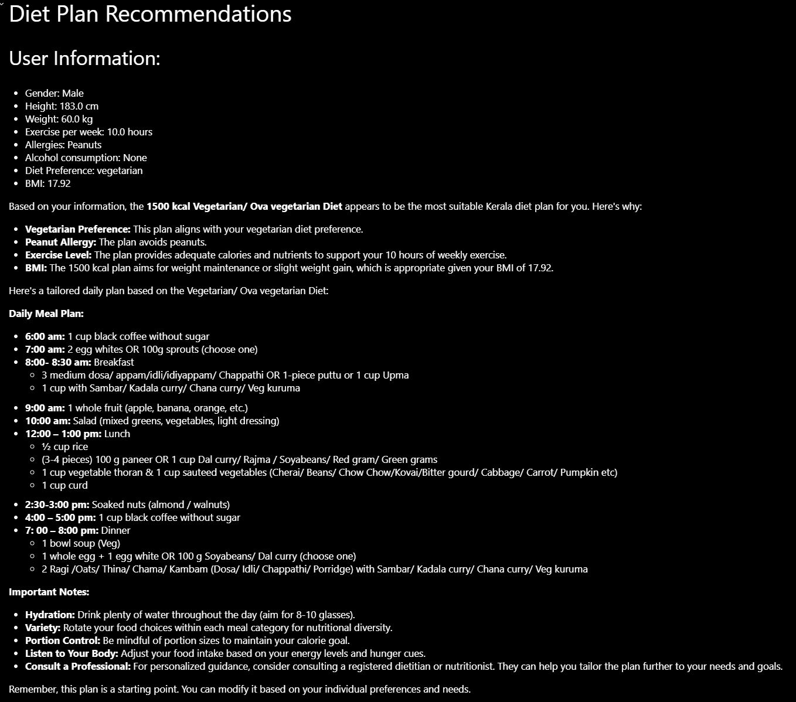

**MASLD Meal Mate** - Personalized Diet Recommendations

**MASLD Meal Mate** is a **Telegram bot** designed to provide **Kerala-based diet recommendations** for individuals suffering from **Metabolic-Associated Steatotic Liver Disease (MASLD)**. It generates personalized meal plans using **Generative AI (Gemini LLM)** based on the user's dietary preferences, exercise habits, allergies, and calorie requirements.
---

## :sparkles: Features

- **Personalized Kerala-Based Diet Plans**:  
  Tailored meal recommendations focused on **Kerala cuisine** for MASLD patients.

- **Customizable User Inputs**:  
  Users can provide details such as **gender**, **height**, **weight**, **exercise habits**, **allergies**, and **diet preferences** (e.g., vegetarian, non-vegetarian).

- **Generative AI**:  
  Leverages **Gemini LLM** to generate **real-time, personalized meal plans** based on user inputs.

- **Flexible Diet Options**:  
  Offers **1500 kcal vegetarian**, **non-vegetarian**, **lactose-free**, and other customized diet plans.

- **User Engagement**:  
  The interactive **Telegram bot interface** ensures users can easily follow their personalized diet plan.

---

## :wrench: Built With

- **Python** - The main programming language used.
- **Telegram Bot API** - For interacting with users.
- **Google Gemini LLM** - For generating personalized diet recommendations.
- **dotenv** - For securely managing API keys.
- **Telebot** - Python framework for building Telegram bots.

---

## :memo: How It Works

1. **User Interaction**:  
   Users interact with the Telegram bot and answer questions about their **health**, **exercise**, **allergies**, and **diet preferences**.

2. **Generative AI Processing**:  
   The **Gemini LLM** processes the user data and generates a customized meal plan, cross-referencing with **Kerala-based diets**.

3. **Meal Plan Delivery**:  
   The bot sends the user their personalized meal plan, including dietary tips and recommended meals.

4. **Real-Time Adjustments**:  
   Meal plans can be adjusted based on preferences, allergies, and special dietary needs.

---

## :package: Setup & Installation

### 1. Clone the Repository

```bash
git clone https://github.com/deepan484/MASLD-Meal-Mate.git
cd MASLD-Meal-Mate
```

### 2. Install Dependencies

``` Install the below libraries alone :
os
telebot
types (from telebot)
dotenv
google.generativeai
```

### 3. Set Up Telegram Bot

- Create a bot via [BotFather](https://core.telegram.org/bots#botfather).
- Get your **API Token** and update the `.env` file with the token.

### 4. Set Up API Keys

- Add your **Gemini API Key** to the `.env` file to access the Generative AI model.

### 5. Run the Bot

```bash
python main.py
```

---

## :bulb: Example User Flow

1. **User starts the bot** and answers a series of questions (e.g., height, weight, exercise, allergies).
2. **Generative AI** processes the input data and generates a **personalized Kerala diet plan**.
3. The user receives the **diet plan** and **meal recommendations** via Telegram.

---

## :mag: Screenshot

Here's an example of the meal plan generated by the bot:



---
